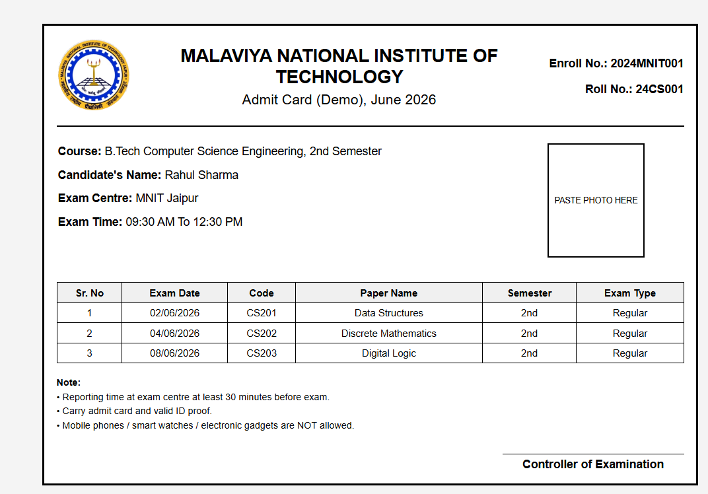

# MNIT Admit Card Generator

## Screenshots

Example:





A frontend-based admit card generator built using HTML, CSS, JavaScript, html2canvas, and jsPDF.

This project dynamically generates student admit cards and allows users to download all admit cards as a combined PDF document.

---

## Features

- Dynamic admit card generation
- Multiple student support
- PDF download functionality
- Clean and printable UI
- Organized folder structure
- Responsive layout support

---

## Technologies Used

- HTML5
- CSS3
- JavaScript
- html2canvas
- jsPDF

---

## Project Structure

```txt
MNIT-Exam-Utility/
│
├── index.html
├── style.css
├── script.js
│
├── data/
│   └── students.js
│
├── assets/
│   └── logo.png
│
└── README.md
```

---

## Future Improvements

- Add student form input
- Add database support
- Add photo upload functionality
- Add print functionality
- Add authentication system
- Convert into full exam utility portal

---

## Disclaimer

This project is created for educational and demonstration purposes only.

It is not affiliated with or endorsed by MNIT Jaipur.

---

## License

This project is licensed under the MIT License.
